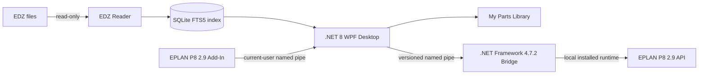

<div align="center">

# EPLAN EDZ Manager

### Fast local EDZ search, personal parts library, and official EPLAN selective export

A Windows desktop tool for browsing and managing large EPLAN EDZ parts libraries<br>
without importing thousands of unnecessary parts into EPLAN first.

**Independent, unofficial project · Verified with EPLAN P8 2.9.4.14642**

**English** | [简体中文](README.zh-CN.md)

[Download](#download) · [Screenshots](#screenshots) · [Features](#features) · [Installation](#installation) · [Known limitations](#known-limitations)

</div>

<p align="center">
  
  
  
  <a href="../../releases/tag/v1.0.0-beta.6"></a>
  <a href="docs/RELEASE_NOTES_1.0.0-beta.6.md"></a>
  <a href="LICENSE"></a>
</p>

## Screenshots

<p align="center">
  
</p>

Beta.6 catalog view with normalized Chinese descriptions. The screenshot shows a local library with 61 EDZ archives and 207,424 part records; the application does not include this data.

### Updated beta.6 screens

| Double-click part preview | Fully localized safe-import wizard |
|---|---|
|  |  |
| Double-clicking a result opens the first supported embedded picture. It may be a 2D product drawing or a vendor-provided 3D render, depending on the EDZ contents. | The eight-step EPLAN MDB workflow is localized in Chinese and still requires a validated EDZ, an explicit target database, Preview, backup and final confirmation before any write. |

| My Library source status |
|---|
|  |
| Saved records remain visible if a source EDZ is moved or removed. The application reports the missing source explicitly instead of silently substituting another package. |

**171/171 release-gate tests** · **SQLite FTS5** · **Offline Mode verified** · **EPLAN 2.9.4.14642 verified**

See the [beta.6 release notes](docs/RELEASE_NOTES_1.0.0-beta.6.md) for the exact fixes, safety boundaries and verification scope.

## Why EPLAN EDZ Manager?

### Search before importing

Index and search parts across multiple EDZ packages without first importing an entire vendor library into EPLAN.

### Preview parts and resources

Inspect part metadata, product images, EPLAN macros, and referenced resources directly from the source EDZ package.

### Build your personal parts library

Keep durable saved parts with favorites, tags, collections, notes, and an explicitly chosen preferred EDZ source.

### Export through EPLAN itself

Selected EDZ output is generated through the official EPLAN 2.9 import/export path and verified by re-import. The project does **not** implement a custom EDZ writer.

## Download

Latest beta: **v1.0.0-beta.6** for Windows x64.

- [Windows x64 Installer](../../releases/download/v1.0.0-beta.6/EplanEdzManager-1.0.0-beta.6-x64-Setup.exe)
- [Portable ZIP](../../releases/download/v1.0.0-beta.6/EplanEdzManager-1.0.0-beta.6-x64.zip)
- [SHA-256 checksums](../../releases/download/v1.0.0-beta.6/SHA256SUMS.txt)
- [Release notes](../../releases/tag/v1.0.0-beta.6)

> This is an **unsigned beta**. Windows SmartScreen may display an unknown-publisher warning. Keep SmartScreen and antivirus protection enabled and verify the SHA-256 checksum.

EPLAN is **not required** for offline EDZ indexing, search, preview, My Library, or resource export. EPLAN-dependent export/import features require a locally installed, verified EPLAN P8 `2.9.4.14642` runtime.

## Features

| Feature | What it does |
|---|---|
| EDZ Library Index | Registers library folders and builds a local, disposable catalog without modifying source EDZ files. |
| Fast Search | Searches Part Number, Type Number, Manufacturer, Description, and full text through SQLite FTS5, exact, and contains modes. |
| Part Preview | Reads metadata, pictures, macros and resource references on demand; double-click opens the first supported embedded picture in a dedicated viewer. |
| My Parts Library | Saves favorites, tags, collections, notes, metadata snapshots, and preferred sources independently of catalog rescans. |
| Multi-source Parts | Tracks multiple EDZ candidates for the same logical part without silently choosing or merging them. |
| Selective EDZ Export | Creates a selected-parts EDZ through the official EPLAN 2.9 API path, then performs official and offline validation. |
| Safe MDB Import | Inspects a user-selected closed Access MDB, previews conflicts, backs it up, imports through EPLAN, reopens it, verifies outcomes, and writes an audit. |
| EPLAN Add-In | Launches or activates the desktop app and passes read-only EPLAN context through a current-user local pipe. |
| Offline Mode | Keeps catalog, search, preview, My Library, and diagnostics available when EPLAN is absent. |

## Installation

### Installer

Run `EplanEdzManager-1.0.0-beta.6-x64-Setup.exe`. The per-user installer does not normally require administrator rights. First Run Setup checks the environment, lets you register an EDZ library folder, and configures the local SQLite data location.

### Portable ZIP

Extract the ZIP to a writable folder and run `Desktop\EplanEdzManager.Desktop.exe`. The portable build intentionally stores settings, SQLite data, logs, and backups under `%LOCALAPPDATA%\EplanEdzManager`; beta.6 does not provide a separate portable data-root flag.

### Requirements

- Windows x64.
- No separately installed .NET 8 Desktop Runtime is required; Desktop and command-line tools are self-contained.
- Bridge and Add-In features require .NET Framework 4.7.2 or later and EPLAN P8 `2.9.4.14642`.
- EPLAN Add-In registration remains a manual action in EPLAN's official **Options / API Add-Ins** dialog. See [Add-In installation](docs/EPLAN_ADDIN_INSTALLATION.md).
- The release does not contain or download `Eplan.EplApi.*.dll`; it resolves required proprietary assemblies from the user's local EPLAN installation.

For the complete workflow, see the [User Guide](docs/USER_GUIDE.md) and [Troubleshooting](docs/TROUBLESHOOTING.md).

## Architecture



The Desktop remains usable without EPLAN. Only the isolated x64/net472 Bridge and Add-In boundary loads the locally installed EPLAN runtime. EPLAN proprietary binaries are not distributed with this project.

## Safety

- Source EDZ packages are opened read-only and are never overwritten.
- No custom EDZ writer is used; final selected EDZ output goes through EPLAN's official API path.
- MDB import requires inspect, Preview, explicit confirmation, fingerprint rechecks, a verified backup, official import, reopen/verification, and a local audit report.
- Existing or conflicting parts default to **Skip**; Selective Update is disabled.
- The application does not directly write EPLAN database tables through SQL or file patching.
- Credentials, API keys, project data, EDZ files, and user databases are not uploaded; the application has no telemetry requirement.

Read [Security and safety](SECURITY.md), [privacy and local data](docs/PRIVACY_AND_DATA.md), and the detailed [MDB import safety model](docs/PARTS_DATABASE_IMPORT_SAFETY.md).

## Known limitations

- The beta is unsigned; SmartScreen may show an unknown-publisher warning.
- Only EPLAN P8 `2.9.4.14642` is verified. Other 2.9 versions are detected but EPLAN write capabilities remain disabled; EPLAN 2022+ is unsupported by this build.
- The EPLAN Add-In must be registered manually.
- Safe import supports only a closed, exclusively accessible EPLAN 2.9 Access MDB. SQL Server, active/locked MDBs, automatic schema migration, and Selective Update are not supported.
- An MDB backup protects the database file but cannot roll back resource files already written by the official importer.
- PDF, construction, mechanical-model, and accessory resource coverage is not yet complete.
- Selected-part context is reported as `Unavailable` when the tested read-only EPLAN API routes do not expose an assigned part; the application does not guess from the active database.
- The Desktop UI is currently primarily Chinese; the English UI translation is incomplete.
- A separate Windows Sandbox/VM human acceptance run remains on the [clean-machine checklist](docs/CLEAN_MACHINE_TEST_CHECKLIST.md).

## Development and evidence

- [Developer Guide](docs/DEVELOPER_GUIDE.md)
- [beta.6 Release Notes](docs/RELEASE_NOTES_1.0.0-beta.6.md)
- [Technical and safety documentation](docs/)
- [Third-party notices](THIRD_PARTY_NOTICES.md)

The release build rejects EPLAN proprietary DLLs, source EDZ files, databases, tests, samples, symbols, and development-only paths from the packaged output.

## Build from source

Source builds require Windows x64, a .NET 8-capable SDK and PowerShell 7. End users do not need these tools when using the self-contained release packages.

```powershell
pwsh -File scripts/Test-Offline.ps1
```

The offline path builds Desktop and tools and runs EPLAN-independent tests using synthetic data. Full local release and integration testing additionally require legally obtained EPLAN assemblies from the developer's own installation, provided only through ignored local configuration. Never copy them into the repository.

Before publishing source, run `pwsh -File scripts/Test-PublicReleaseGate.ps1 -RequireLicense`. See [Contributing](CONTRIBUTING.md) and [Security](SECURITY.md).

## License and trademark

Original project source is released under the [MIT License](LICENSE). Third-party components and EPLAN itself remain under their respective licenses; see [Third-party notices](THIRD_PARTY_NOTICES.md).

This project is an independent tool and is not affiliated with or endorsed by EPLAN GmbH & Co. KG. EPLAN is a trademark of its respective owner.
