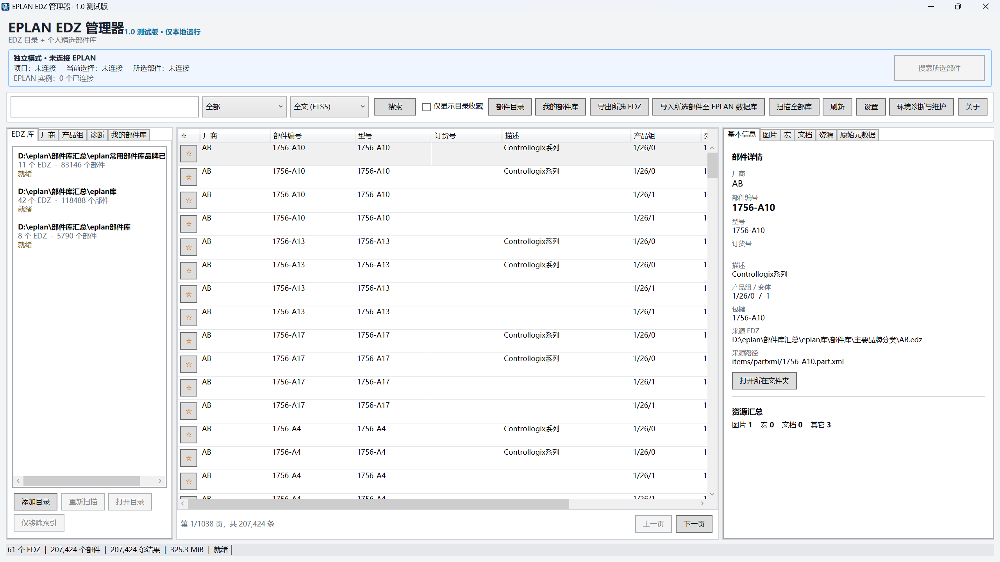
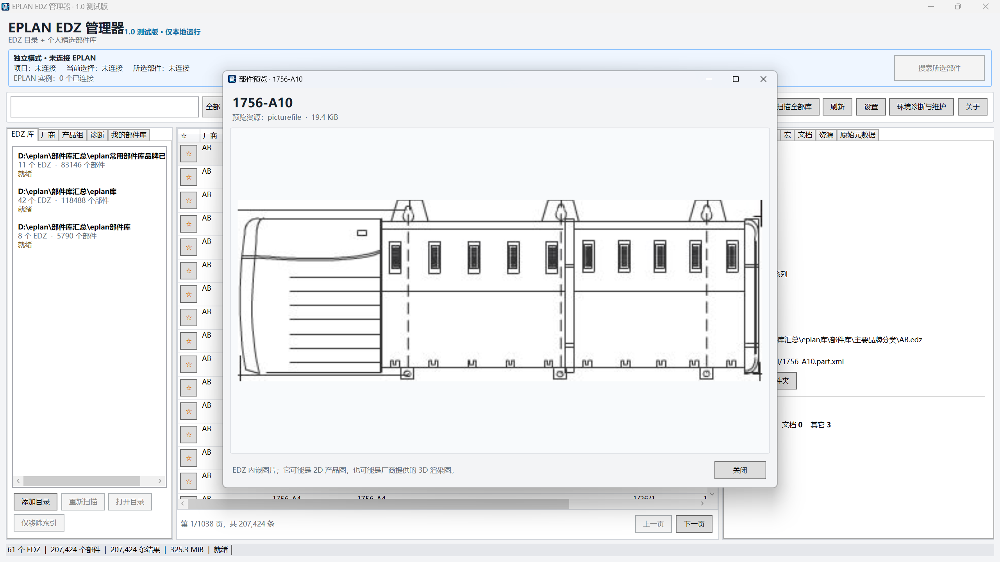
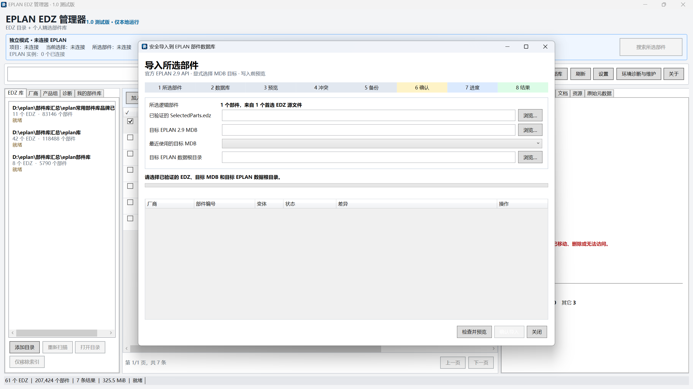
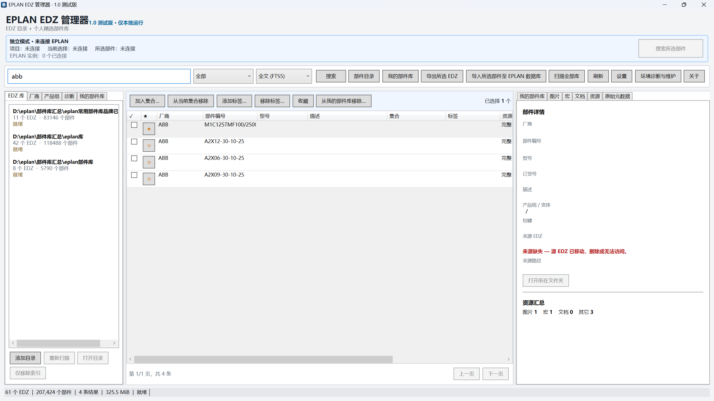
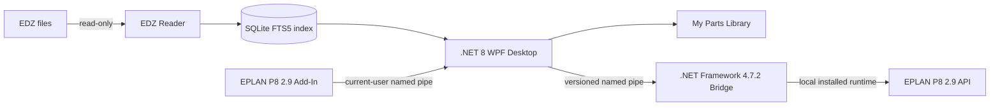

<div align="center">

# EPLAN EDZ Manager

### 本地快速检索 EDZ、管理个人部件库，并通过 EPLAN 官方能力选择性导出

一款 Windows 桌面工具，用于浏览和管理大型 EPLAN EDZ 部件库，<br>
无需先把成千上万个不需要的部件全部导入 EPLAN。

**独立、非官方项目 · 已在 EPLAN P8 2.9.4.14642 上验证**

[English](README.md) | **简体中文**

[下载](#下载) · [演示](#演示) · [功能](#功能) · [安装](#安装) · [已知限制](#已知限制)

</div>

<p align="center">
  
  
  
  <a href="../../releases/tag/v1.0.0-beta.6"></a>
  <a href="docs/RELEASE_NOTES_1.0.0-beta.6.md#验证结果"></a>
  <a href="LICENSE"></a>
</p>

## 软件预览

<p align="center">
  
</p>

真实 beta.6 目录界面，中文描述已完成规范化显示。截图中的本地演示索引包含 61 个 EDZ、207,424 条部件记录；这是用户本机目录统计，不代表软件内置数据或性能承诺。

### beta.6 真实操作截图

| 双击查看部件图片 | 已汉化的安全导入向导 |
|---|---|
|  |  |
| 双击结果可打开首个受支持的内嵌图片。具体画面取决于 EDZ 内容，可能是 2D 产品图，也可能是厂商提供的 3D 渲染图。 | EPLAN MDB 八步导入界面已完整汉化；写入前仍必须选择已验证 EDZ、明确的目标数据库，完成预览、备份和最终确认。 |

| 我的部件库来源状态 |
|---|
|  |
| 源 EDZ 被移动或删除后，已保存记录仍会保留，并明确显示“来源缺失”，不会静默替换为其它包。 |

**发布门禁测试 171/171** · **SQLite FTS5** · **Offline Mode 已验证** · **EPLAN 2.9.4.14642 已验证**

本次修复范围、安全边界和验证记录见 [beta.6 发布说明](docs/RELEASE_NOTES_1.0.0-beta.6.md)。

## 为什么使用 EPLAN EDZ Manager？

### 导入前先搜索

先对多个 EDZ 包中的部件建立本地索引并搜索，不必把整个厂商部件库预先导入 EPLAN。

### 先预览部件与资源

直接从源 EDZ 按需查看部件元数据、产品图片、EPLAN 宏及已记录的资源引用。

### 建立自己的常用部件库

长期保存常用部件，可维护收藏、标签、集合、备注，并显式选择首选 EDZ 来源；目录重扫不会删除这些个人数据。

### 通过 EPLAN 自身能力导出

选择性 EDZ 通过 EPLAN 2.9 官方导入/导出路径生成，并进行官方回读验证。本项目**没有自行实现 EDZ Writer**。

## 演示

<!-- 在这里加入真实软件演示：docs/images/demo-search.gif -->

> 这里还需要补一段真实软件操作演示。请按[20 秒录制指南](docs/DEMO_GIF_GUIDE.md)展示搜索、预览和收藏，并避免暴露私人数据。

## 下载

最新测试版：Windows x64 **v1.0.0-beta.6**。

- [Windows x64 安装程序](../../releases/download/v1.0.0-beta.6/EplanEdzManager-1.0.0-beta.6-x64-Setup.exe)
- [Portable ZIP](../../releases/download/v1.0.0-beta.6/EplanEdzManager-1.0.0-beta.6-x64.zip)
- [SHA-256 校验值](../../releases/download/v1.0.0-beta.6/SHA256SUMS.txt)
- [Release 说明](../../releases/tag/v1.0.0-beta.6)

> 这是一个**未签名 Beta**。Windows SmartScreen 可能显示“未知发布者”。请保留 SmartScreen 和杀毒软件，并核对 SHA-256。

离线 EDZ 索引、搜索、预览、My Library 和资源导出**不要求安装 EPLAN**。依赖 EPLAN 的 EDZ 导出和 MDB 导入功能，需要本机已安装并通过验证的 EPLAN P8 `2.9.4.14642`。

## 功能

| 功能 | 说明 |
|---|---|
| EDZ Library Index | 登记部件库目录并建立可重建的本地目录，不修改源 EDZ。 |
| Fast Search | 通过 SQLite FTS5、精确和包含模式检索 Part Number、Type Number、Manufacturer、Description 与全文。 |
| Part Preview | 按需读取元数据、图片、宏和资源引用；双击部件可在独立窗口查看首个受支持的内嵌图片。 |
| My Parts Library | 独立保存收藏、标签、集合、备注、元数据快照和首选来源，目录重扫后仍然保留。 |
| Multi-source Parts | 为同一个逻辑部件保留多个 EDZ 候选来源，不静默合并或擅自选择。 |
| Selective EDZ Export | 通过 EPLAN 2.9 官方 API 路径生成所选部件 EDZ，再执行官方和离线双重验证。 |
| Safe MDB Import | 检查用户明确选择的已关闭 Access MDB，预览冲突、备份、官方导入、重新打开验证并生成审计记录。 |
| EPLAN Add-In | 启动或激活 Desktop，并通过当前用户本地命名管道传递只读 EPLAN 上下文。 |
| Offline Mode | 未安装 EPLAN 时仍可使用目录、搜索、预览、My Library 和诊断。 |

## 安装

### 安装程序

运行 `EplanEdzManager-1.0.0-beta.6-x64-Setup.exe`。这是按用户安装的程序，通常不需要管理员权限。首次启动向导会检查环境、登记 EDZ 部件库目录并配置本地 SQLite 数据位置。

### Portable ZIP

解压到可写目录后，运行 `Desktop\EplanEdzManager.Desktop.exe`。Portable 版本仍会把设置、SQLite 数据、日志和备份保存在 `%LOCALAPPDATA%\EplanEdzManager`；beta.6 暂不提供独立的 portable data-root 参数。

### 运行要求

- Windows x64。
- Desktop 与命令行工具为 self-contained，不要求目标电脑另外安装 .NET 8 Desktop Runtime。
- Bridge 和 Add-In 功能需要 .NET Framework 4.7.2 或更高版本，以及 EPLAN P8 `2.9.4.14642`。
- EPLAN Add-In 仍需在 EPLAN 官方 **选项 / API Add-Ins** 对话框中手工登记。参见 [Add-In 安装](docs/EPLAN_ADDIN_INSTALLATION.md)。
- 发布包不包含也不会下载 `Eplan.EplApi.*.dll`；所需专有程序集从用户本机的 EPLAN 安装目录解析。

完整使用流程见[用户指南](docs/USER_GUIDE.md)和[故障排除](docs/TROUBLESHOOTING.md)。

## 架构



未安装 EPLAN 时 Desktop 仍可独立使用。只有隔离的 x64/net472 Bridge 与 Add-In 边界会加载本机 EPLAN Runtime。本项目不分发 EPLAN 专有二进制文件。

## 安全边界

- 源 EDZ 始终只读打开，绝不覆盖。
- 不使用自制 EDZ Writer；最终选择性 EDZ 走 EPLAN 官方 API 路径。
- MDB 导入必须经过 Inspect、Preview、用户明确确认、指纹复核、验证备份、官方导入、重开验证和本地审计。
- 已存在或冲突的部件默认 **Skip**；Selective Update 已禁用。
- 不通过 SQL 或文件补丁直接写 EPLAN 数据库表。
- 凭据、API Key、项目数据、EDZ 和用户数据库不会上传；应用不依赖遥测。

请阅读[安全与漏洞说明](SECURITY.md)、[隐私与本地数据](docs/PRIVACY_AND_DATA.md)和详细的 [MDB 导入安全模型](docs/PARTS_DATABASE_IMPORT_SAFETY.md)。

## 已知限制

- Beta 尚未签名，SmartScreen 可能显示“未知发布者”。
- 仅 EPLAN P8 `2.9.4.14642` 已验证。其它 2.9 版本只检测、不启用 EPLAN 写能力；此构建不支持 EPLAN 2022+。
- EPLAN Add-In 需要手工登记。
- 安全导入仅支持已关闭且可独占访问的 EPLAN 2.9 Access MDB；不支持 SQL Server、活动/锁定 MDB、自动 Schema 升级和 Selective Update。
- MDB 备份保护数据库文件，但无法回滚官方导入器已经写入目标目录的资源文件。
- PDF、construction、mechanical model 和 accessory 等高级资源覆盖尚不完整。
- 当已覆盖的只读 EPLAN API 路径未暴露已分配部件时，Selected Parts Context 会显示 `Unavailable`；程序不会从活动数据库猜测。
- Desktop 当前以中文界面为主，英文 UI 翻译尚未完成。
- 独立 Windows Sandbox/VM 人工验收仍保留在[干净电脑检查清单](docs/CLEAN_MACHINE_TEST_CHECKLIST.md)中。

## 开发与证据

- [开发者指南](docs/DEVELOPER_GUIDE.md)
- [beta.6 发布说明](docs/RELEASE_NOTES_1.0.0-beta.6.md)
- [技术与安全文档](docs/)
- [第三方声明](THIRD_PARTY_NOTICES.md)

发布构建会拒绝把 EPLAN 专有 DLL、源 EDZ、数据库、测试、样本、符号文件或开发机路径打进安装包。

## 从源码构建

源码构建需要 Windows x64、支持 .NET 8 的 SDK 和 PowerShell 7。使用自包含发布包的普通用户不需要安装这些开发工具。

```powershell
pwsh -File scripts/Test-Offline.ps1
```

离线路径会构建 Desktop 与工具，并用合成数据运行不依赖 EPLAN 的测试。完整本地发布和集成测试还需要开发者从自己合法安装的 EPLAN 中提供程序集，而且只能通过被忽略的本地配置引用，禁止复制进仓库。

发布源码前运行 `pwsh -File scripts/Test-PublicReleaseGate.ps1 -RequireLicense`。另见[贡献说明](CONTRIBUTING.md)和[安全说明](SECURITY.md)。

## 许可证与商标

本项目原创源码按 [MIT License](LICENSE) 发布。第三方组件与 EPLAN 本身仍遵循各自许可证，详见[第三方声明](THIRD_PARTY_NOTICES.md)。

本项目是独立工具，与 EPLAN GmbH & Co. KG 无隶属、赞助或背书关系。EPLAN 是其各自权利人的商标。
